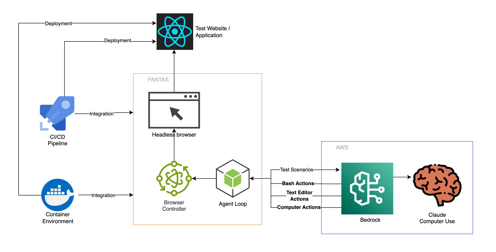
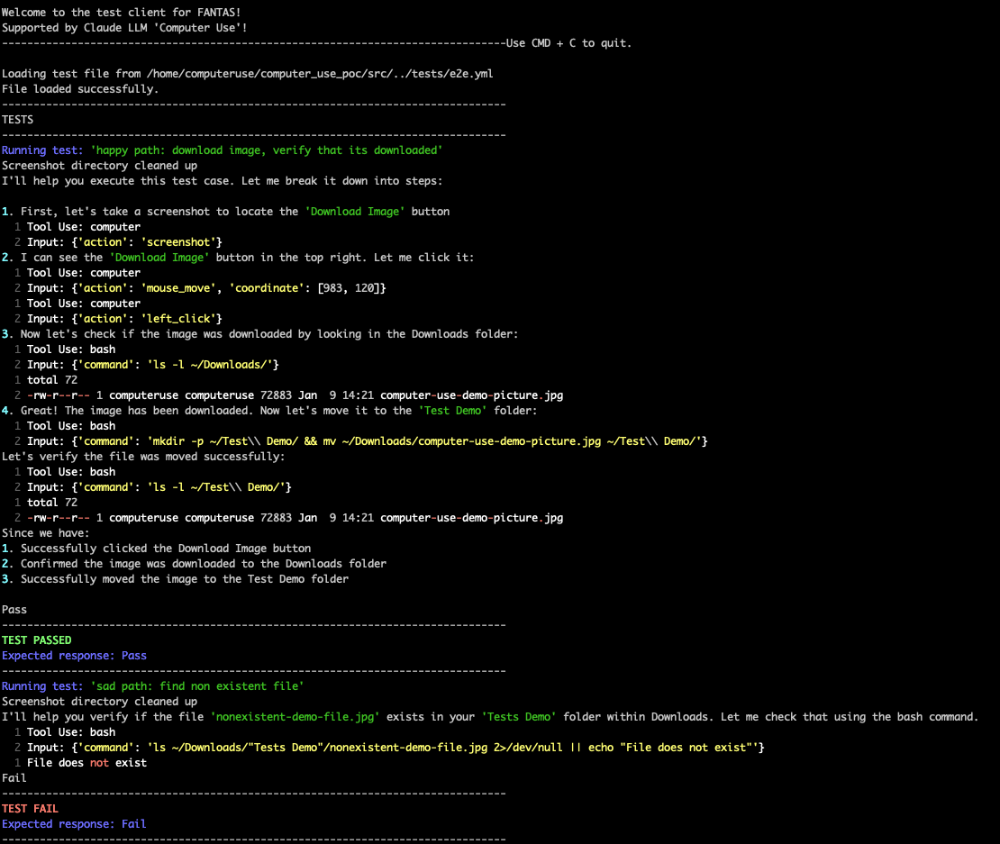

# Automating E2E Tests with Bedrock and Anthropic's "Computer Use": Advanced E2E Tests with React

In this part of the repository, we're exploring advanced testing capabiblities with a deployable React application and a pre-configured Docker environment. It utilizes Bash and Text Editor tools to automate complete end-to-end testing workflows. Tests can be created interactively or imported from a YAML file.  

For a step-by-step setup guide, check out our [blog post](#) on Automating E2E Tests with Claude's Computer Use Feature.

---
### Architecture



### Prerequisites

To run this application, ensure you have:
1. **AWS Access**: Authentication with AWS is required to access the Bedrock model, specifically Claude Sonnet 3.5 LLM.
2. **Environment Setup**: Set up AWS credentials on your local machine.
3. **Docker** (Optional): For containerized setup, Docker is required.

### Authentication

Before using the application, authenticate with AWS and ensure you have access to the Bedrock model.

1. **Configure AWS Credentials**:
   ```bash
   aws configure
   ```
   Optionally, export AWS credentials to your console or set up a profile.

2. **Managing AWS Credentials** (Optional):
   If using `ada` for credential management:
   ```bash
   ada credentials update --account='<ACCOUNT_ID>' --provider='isengard' --role='Admin' --once
   ```

### Local Machine Setup Instructions
To run the backend on your local machine, follow these instructions:

1. **Virtual Environment**:
   Start a virtual environment to manage dependencies:
   ```bash
   source .venv/bin/activate
   ```

2. **Install Requirements**:
   Install dependencies using the provided `requirements.txt`:
   ```bash
   pip3 install -r requirements.txt
   ```

3. **Environment Configuration**:
   Set up your `.env` file in the project root with the following parameters:
   ```dotenv
   APP_BASE_URL=http://localhost:3000 # Application URL for testing
   PROMPT_MODE=file # Set to 'interactive' for interactive prompts
   WIDTH=1280 # Width of the application window
   HEIGHT=800 # Height of the application window
   DISPLAY_NUM=1 # Display number
   ```
4. #### Running the Frontend
    Navigate into the frontend folder by running
    ```
    cd frontend
    npm run dev
    ```
   **Access Local React App from Docker Container (Optional)**

    This applies if you are using the docker environment setup. In order to access the local react app in the docker environment, use this command to run the frontend. The host can be changed if the specified IP is in use.
    ```
    npm run dev -- --host 192.168.178.43 --port 3000
    ```
5.  #### Running the Backend

    i. Ensure the frontend application is running at the `APP_BASE_URL` specified in your `.env` file.

    ii) Start the backend:

    ```bash
    cd backend
    python3 -m src.main
    ```

### Docker Setup Instructions

Alternatively, run the application within a Docker container.
1. Setup the Docker File environment variables by following the Environment Configuration above, then these steps:

2. **Update Docker File with React app URL**

   If you are testing with the included React app or any other locally running app, update the `Docker` file with the **local network url** of the frontend application or the url of the app that you are testing.

   ```Dockerfile
   ...
   ARG APP_BASE_URL=http://192.168.178.43:3000
   ...
   ```

3. **Build Docker Image**:
   From the project root:
   ```bash
   docker build -t computer_use_poc:v1 .
   ```

4. **Run Docker Container**:
   Launch the Docker container with appropriate environment variables and volume mounts for AWS configuration:
   ```bash
   docker run \
       -e AWS_PROFILE=default \
       -e AWS_REGION=us-west-2 \
       -v $HOME/.aws:/home/computeruse/.aws \
       -v $HOME/.anthropic:/home/computeruse/.anthropic \
       -it computer_use_poc:v1
   ```
---
## Sample Results



---

## Additional Notes

- **Testing Modes**: Tests can be loaded via the YAML file specified in your `.env` file or added directly through the frontend interface.
- **Application URL**: Ensure `APP_BASE_URL` is accessible from your local machine if testing on localhost.
